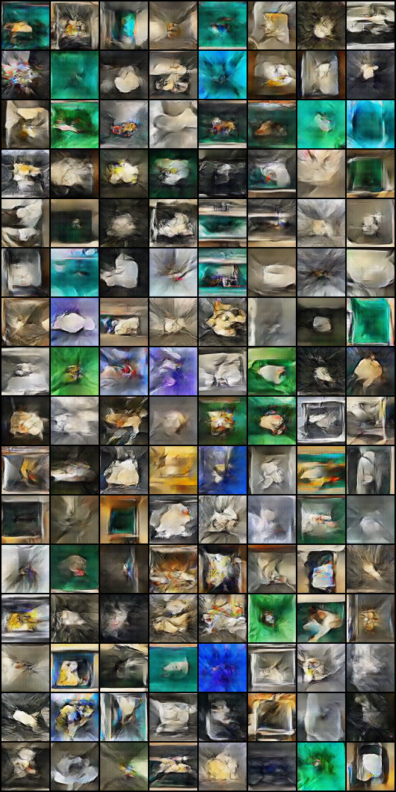

# DCGAN Architecture for Waste Image Synthesis

## Overview

This repository contains the implementation of a Deep Convolutional Generative Adversarial Network (DCGAN) designed to generate synthetic images of waste. The primary goal of this project is to enhance our Yolov8 model in waste classification by providing additional training data and augmenting it using the images generated by this model. We are hoping to solve the class imbalance.

## Repository Structure

-   `image_preprocessing.py`: Code for preprocessing images for training the DCGAN.
-   `dcgan.py`: The main script containing the DCGAN architecture and training loop.
-   `~.png`: Example outputs from various training configurations.

## Results

Throughout the development of this DCGAN, several configurations and parameters were adjusted to explore their impact on the quality of the generated images, the results are still not satisfactory but the idea is interesting and possible:

### Learning Rates

-   **Trial 1**: Generator LR = 0.0002, Discriminator LR = 0.0002
-   **Trial 2**: Generator LR = 0.0004, Discriminator LR = 0.0001
-   **Trial 3**: Generator LR = 0.0004, Discriminator LR = 0.0002
-   **Trial 4**: Generator LR = 0.0008, Discriminator LR = 0.0002

### Image Resolutions

-   512x512
-   256x256
-   128x128
-   64x64

### Network Complexity

-   Increased layers in both the generator and discriminator.

### Training Duration

-   Epochs tested: 50, 200, 500, 2000, 4000, 9000

### Batch Size

-   Experimentation with decreasing the batch size to observe effects on image quality.

Despite these extensive experiments, the quality of the generated images did not meet expectations, suggesting that factors other than the explored parameters might be impacting the performance.

### Proof of Concept

A successful PoC was implemented, which involves generating a fake trash image using DALLE and then successfully classifying it with the YOLOv8 model. This demonstrates the validity of using synthetic images for training classification models.

_Figure: Best generated image from the DCGAN. This image represents the peak performance of the current configuration._

## Potential Improvements

To further enhance the DCGAN's performance, the following strategies could be considered:

-   **Data Quality**: Improving the quality and variety of the input data used for training the model.
-   **Advanced Architectural Features**: Integrating more sophisticated GAN architectures such as StyleGAN or incorporating attention mechanisms.
-   **Hyperparameter Tuning**: Further experimentation with hyperparameters, especially focusing on the stability of training processes.
-   **Regularization Techniques**: Implementing regularization methods like dropout or adding noise to inputs might help in stabilizing training.
-   **Transfer Learning**: Utilizing a pre-trained model as a backbone for the generator and discriminator might improve the learning process.

## Conclusion

The current DCGAN architecture provides a foundational framework for generating synthetic waste images, but further improvements are necessary to enhance image quality. The experiments conducted provide valuable insights into the limitations and capabilities of the model, guiding future development efforts.
