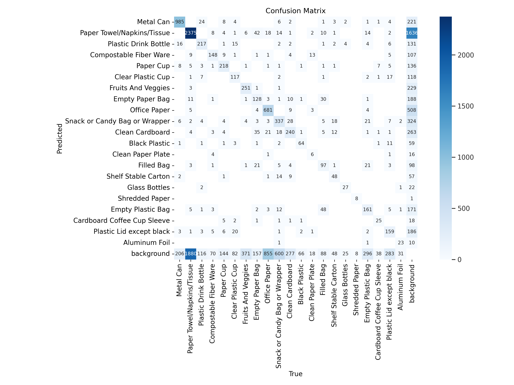
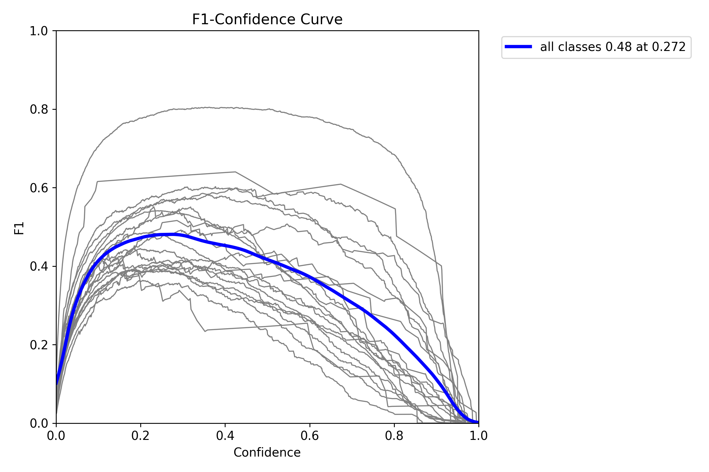
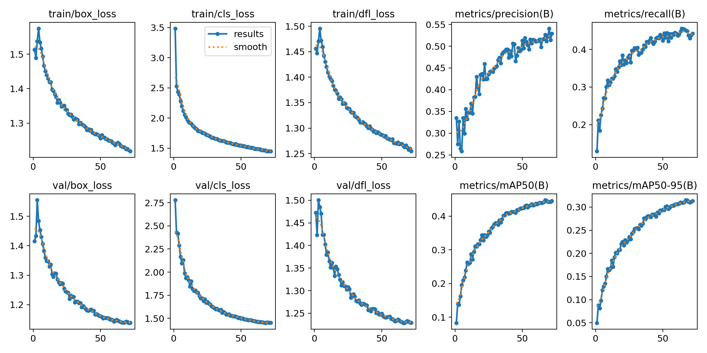

# Spare-it: Contamination Identifier

## Project Description

[Spare-it](https://www.spare-it.com/) is dedicated to assisting businesses, office owners, and universities in obtaining real-time data on various types of workspace waste, including general waste, recycling, electronics, energy, water, and travel. The organization motivates employees and students to minimize waste through awareness and actionable intelligence. The goal of this project is to develop a machine learning model capable of predicting contamination and identifying missed opportunities for recycling and waste management.

[DEMO](https://huggingface.co/spaces/jasonoh/spare-it)

## Directory Explanation

- **`/1.ProjectOutline`**: This directory contains the project outline, where we've detailed the stakeholders' goals for the project and outlined the steps our team needs to take to achieve those goals.

- **`/2.Research`**: This directory contains initial research related to the topic, which formed the basis for generating the image detection model for Spare-it.

- **`/3.EDA`**: This directory contains a Jupyter Notebook with our exploratory data analysis on the labels and images provided by Spare-it.

- **`/4.PoC`**: This directory contains the proof of concept, where we've generated a model using YOLOv8 and other libraries like Albumentations. For more detailed information, refer to this directory. Also, DCGAN features are implemented in a separate folder inside our `4.PoC` folder.

- **`/5.Deployment`**: This directory contains our deployment materials. We've deployed the model (`best.pt`) to Hugging Face using Streamlit. The base code is provided here.

- **`/documents`**: This directory contains all written documentation related to the project, such as presentation slides and result metric images.

## Overview

This project aimed to identify contamination and improve recycling and waste management practices. By leveraging image detection models, data analysis, and real-time monitoring, we've created a system that aligns with Spare-it's mission of minimizing waste through actionable intelligence. Each directory in this project represents a key stage of our process, from outlining the project goals to deploying the final model. The various documents and code files showcase our research, development, and implementation efforts, culminating in a machine learning model that enhances sustainability initiatives.

## Results

We have achieved 52.7% accuracy in detecting 20 labels. Here are some results:

### Confusion Matrix

### F1 Curve

### Results

